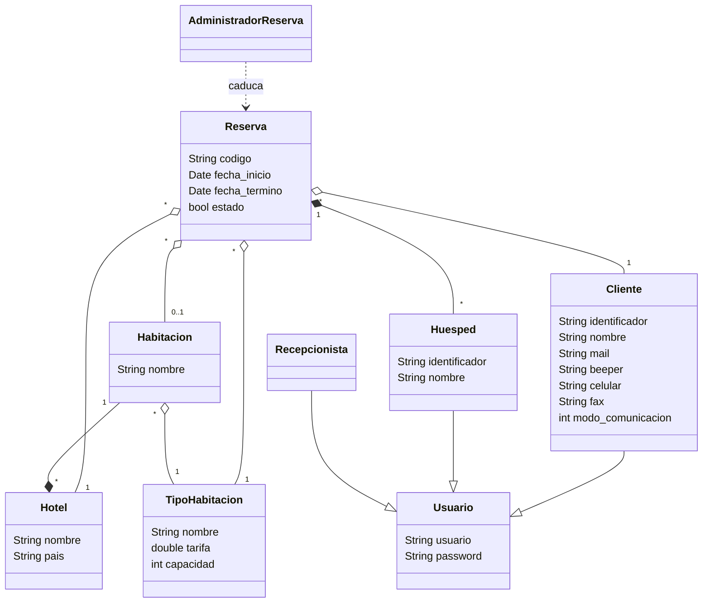

```mermaid
classDiagram
    class Hotel {
        String nombre
        String pais
    }
    class TipoHabitacion {
        String nombre
        double tarifa
        int capacidad
    }
    class Habitacion {
        String nombre
    }
    class Usuario {
        String usuario
        String password
    }
    class Cliente {
        String identificador
        String nombre
        String mail
        String beeper
        String celular
        String fax
        int modo_comunicacion
    }
    class Huesped {
        String identificador
        String nombre
    }
    class Recepcionista
 
    class Reserva {
        String codigo
        Date fecha_inicio
        Date fecha_termino
        bool estado
    }
 
    Reserva "*" o-- "1" Hotel
    Reserva "*" o-- "1" Cliente
    Reserva "*" o-- "1" TipoHabitacion
    Reserva "*" o-- "0..1" Habitacion
    Reserva "1" *-- "*" Huesped
 
    Habitacion "*" o-- "1" TipoHabitacion
    Habitacion "1" --* "*" Hotel
 
 
    Cliente --|> Usuario: 
    Huesped --|> Usuario: 
    Recepcionista --|> Usuario: 
 
    AdministradorReserva ..> Reserva: caduca
```